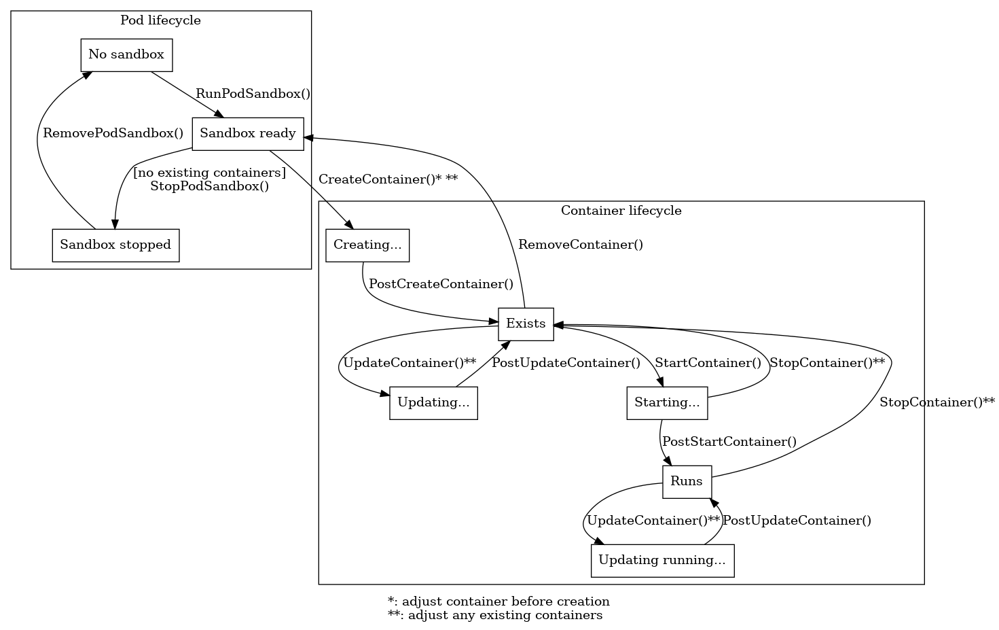

# NRI

## Pod and container lifecycle in NRI plugin perspective

NRI plugins are guaranteed to receive pod and container lifecycle
events/requests in the orders presented in the lifecycle events figure
below.

### Pod events and requests

- `RunPodSandox` event
  - Plugin input: pod information (pod name, namespace, labels, annotations...)
  - Plugin output: nothing
  - Plugin can fail RunPodSandbox request.

- `StopPodSandbox` event
  - Plugin input: pod information
  - Plugin output: nothing

- `RemovePodSandbox` event
  - Plugin input: pod information
  - Plugin output: nothing

### Container events and requests

- `CreateContainer` request: in the beginning of creating a container, attributes can be quite freely modified.
  - Plugin input: pod information, container information before creation (labels, annotations, args, envs, mounts, devices, resources, without oci-level detail)
  - Plugin output:
    - modified container information for the container being created
    - modified container information for existing/running containers
  - Plugin can fail CreateContainer request.

- `PostCreateContainer` event: a container has been successfully created, final attributes are known.
  - Plugin input: pod information, container information (with oci-level detail)
  - Plugin output: nothing

- `StartContainer` event: the last moment to operate on a container before running anything in it. Final information on resources before launch is available: no more update requests coming before launch.
  - Plugin input: pod information, container information
  - Plugin output: nothing

- `PostStartContainer` event: StartContainer on runtime succeeded
  - Plugin input: pod information, container information
  - Plugin output: nothing

- `UpdateContainer` request: in the beginning of a planned update.
  - Plugin input: pod information, container information with current resources/annotations, and resources/annotations to be updated.
  - Plugin output: modified container information for existing/running containers.
  - Plugin can fail UpdateContainer request.

- `PostUpdateContainer` event: react on final container information after (possibly partially) applied update.
  - Plugin input: pod information, container information with new resources and annotations.
  - Plugin output: nothing

- `StopContainer` request
  - Plugin input: pod information, container information
  - Plugin output: modified container information for existing/running containers.

- `RemoveContainer` event
  - Plugin input: pod information, container information
  - Plugin output: nothing

## Initial review remarks

- highprio: should we add container adjustments to RemoveContainer to enable releasing/reusing/rebalancing resources allocated in CreateContainer without calling StopContainer

- highprio: should we promise to send RemoveContainer events to those plugins that have received CreateContainer, but after which CreateContainer has failed? CRI-O implementation already has Start->Stop (fail) and Start->PostStart (success) paths; logically equivalent paths here would be Create->Remove (fail) and Create->PostCreate (success)).

- medprio: should we enable plugins to update containers when they know the final status of an update. Example: CRI UpdateContainer requested additional CPU. NRI UpdateContainer changed CPU pools to make it happen. RUNC failed to change CPUs of the container. Now NRI PostUpdateContainer might want to undo CPU pools change.

- medprio: it is possible that an adjustment (update) induced by a plugin fails. Do we get PostUpdateContainer or anything else that would tell the final state. There is a danger of eternal update loop on buggy plugins, though.

- lowprio: should we enable injecting containers from plugins on RunPodSandbox?
